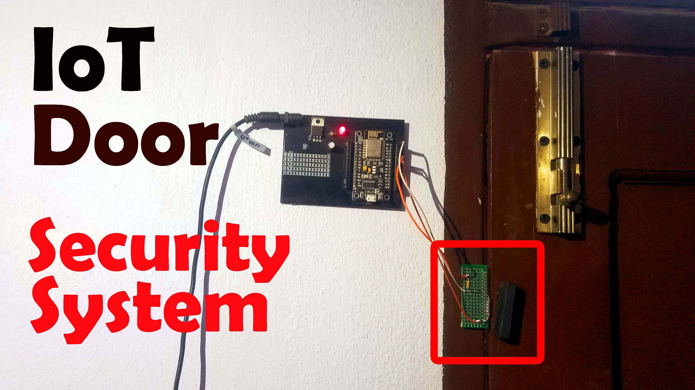

# IoT Door Unlocking Feature



## Overview
This project is an example of an IoT Door Unlocking application built with AWS services, leveraging AWS Lambda, API Gateway, and DynamoDB. This application simulates unlocking a door by receiving requests via a RESTful API and invoking an AWS Lambda function.

## Prerequisites
- AWS Account
- AWS CLI installed and configured
- Node.js installed
- Serverless Framework installed (optional)

## Setup Instructions
1. **Clone this repository:**  
   ```bash  
   git clone <repository-url>  
   cd <repository-name>  
   ```

2. **Deploy the serverless application:**  
   If using the Serverless Framework, run:  
   ```bash  
   serverless deploy  
   ```  
   or use AWS CloudFormation to deploy the `template.yaml` file using AWS CLI:
   ```bash  
   aws cloudformation deploy --template-file template.yaml --stack-name IoTDoorUnlockStack  
   ```

3. **Start the application locally:**  
   ```bash  
   node index.js  
   ```
   The application will be running on `http://localhost:3000`.  

4. **Test the API endpoint:**  
   You can use Postman or curl to test the endpoint:
   ```bash  
   curl -X POST http://localhost:3000/unlock -H 'Content-Type: application/json' -d '{"deviceId":"device123", "userId":"user456"}'  
   ```  
   This should return a JSON response with the door unlock status.

## Technologies Used
- AWS Lambda
- AWS DynamoDB
- Express.js
- AWS SDK for JavaScript

## Conclusion
This project is a basic implementation to demonstrate AWS services in handling IoT data and APIs. Extend this by adding features and improve security according to your use case.